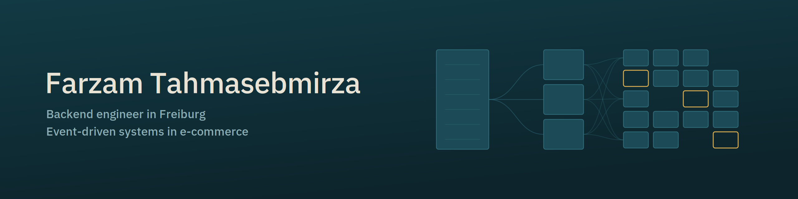

  

## Farzam Tahmasebmirza

Senior backend engineer in Freiburg. Fifteen years, currently at REWE Digital,
mostly e-commerce platform work — event-driven microservices, serverless on
Cloud Run, commercetools, Shopware.

Most of what I've built lives behind company repos. This account is where the
work outside of that will land.

Where I've worked

 

**REWE Digital** — monolith to event-driven services, Cloud Run, commercetools
**Limango** — Go, RabbitMQ, event-driven services on Docker Swarm
**LeasingMarkt** — Clean Architecture, static analysis, technical debt
**OXID eSales** — core framework team, namespace refactoring, test migration

---

[LinkedIn](https://www.linkedin.com/in/farzamtm/) · [X](https://x.com/ftmit) · farzamit@gmail.com
